# Forty

[TOC]

## Trabajo en local

1. Inicializa un nuevo repositorio Git en una carpeta llamada "forty" y agrega los archivos proporcionados en el aula virtual. 

   

   

   

2. Renombra la rama master a main 

   

3. Haz que los ficheros README.txt , LICENSE.txt y passwords.txt sean ignorados por el control de versiones

   

   

4. Crea el archivo passwords.txt . Comprueba que el control de versiones lo ignora 

   

5. Crea una rama llamada "feature-content" . Muévete a esa rama. Cambia, en la línea 3477, el font-size por 1.5em en el archivo main.css . Confirma cambios y haz commit. Muestra los logs de la forma más gráfica posible. 

   

6. Elimina el archivo "passwords.txt" en la carpeta forty . Verifica el estado del repositorio. ¿Hay cambios pendientes?

   

7. Crea un nuevo archivo llamado " about.html ", partiendo del archivo generic.html y agrégalo al repositorio, haz un nuevo commit. 

   

8. Cambia a la rama main . Examina los logs del repositorio de forma gráfica. 

   

9. Modifica algo en el archivo generic.html , comprueba que hay cambios, y realiza otro commit . Examina los logs del repositorio de forma gráfica. 

   

10. Modifica algo en el fichero elements.html . Confirma los cambios, pero no hagas commit. 

    

11. Mira las diferencias de elements.html . Los cambios no nos gustan, deshaz los cambios de elements.html . Comprueba que no hay cambios pendientes. 

    

    se sale con "q"

    

12. Muestra las diferencias entre dos ramas. 

    

13. Fusiona la rama "feature-content" con la rama principal (main). Muestra los logs del repositorio de una forma gráfica y completa. 

    

    

14. Crea una nueva rama llamada " hotfix " y en ella, corrige un error crítico en el archivo " index.html ". (Por ejemplo, añade el enlace a la nueva página about.html) 

    

15. Fusiona la rama "hotfix" con la rama principal y verifica el historial de commits de forma que se vean todas las ramas gráficamente. ¿Borrarías la rama hotfix ? ¿En qué caso? ¿Cómo? 

    

    

    Intentaría tener siempre el número de ramas separado para cada archivo o grupos de archivos para evitar que los errores se expandan. pero una vez fusionadas no me sirven para nada.

16. Muestra el historial de cambios limitado a los últimos 3 commits. 

    

17. Etiqueta el commit actual como "v1.0" y muestra las etiquetas existentes.

    

## Trabajo en remoto

1. Sube al remoto los ficheros de tu repositorio local. Es necesario crear previamente en GitHub un repositorio llamado 'forty' NO crear archivo README.md en el remoto 

   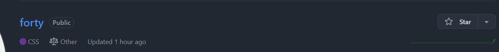

2. En local, crea una rama 'feature-head'. Cambia el título en la sección head de index.html , borra los comentarios del head , o previos, también. Confirma y sube los cambios al remoto.

   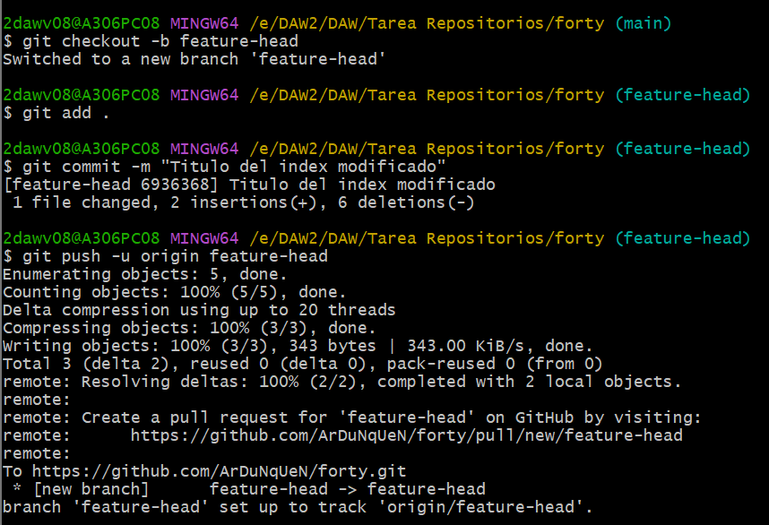

3. En remoto, crea una rama 'feature-articulo'. Duplica la página generic , nómbrala como articulo.html , y añade como contenido un artículo sobre Git. Confirma los cambios y realiza un commit. Muestra los commits del repositorio tal como se ven en GitHub. 

   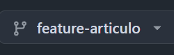

   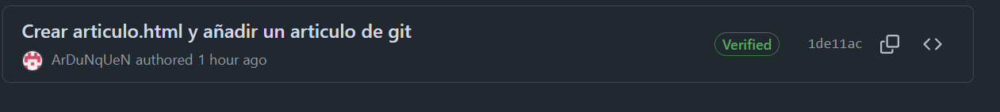

   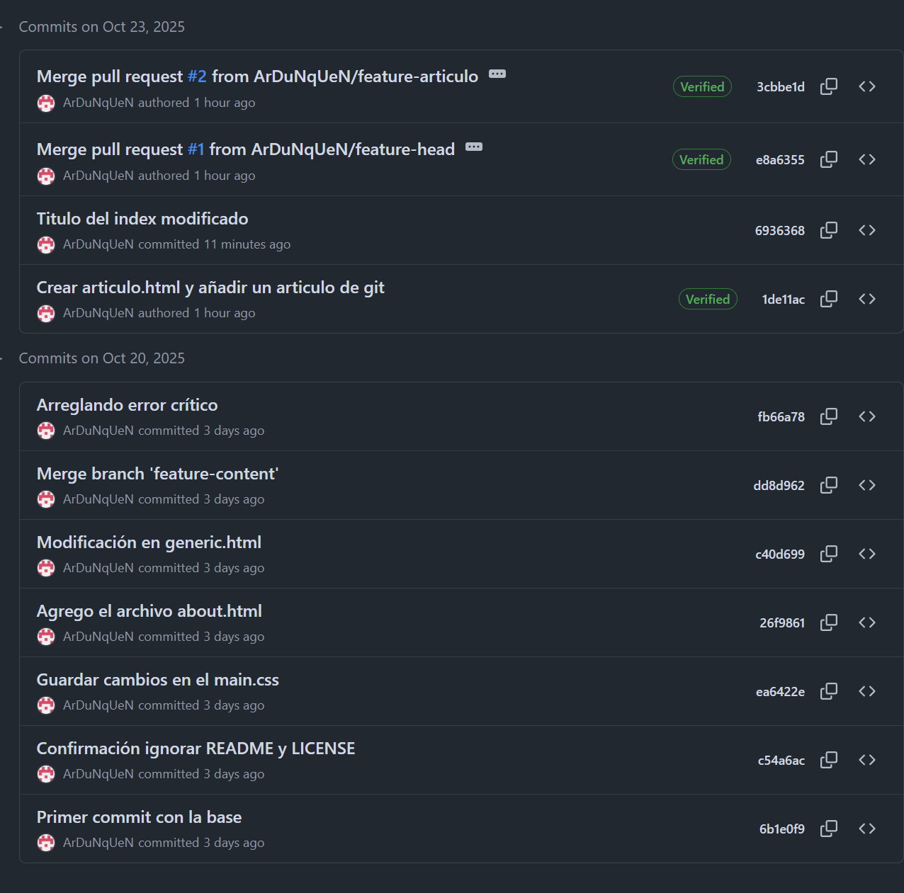

   

4. En el repositorio local examina los cambios. Actualiza el repositorio con el remoto. Fusiona en 'main' las dos ramas 'feature'. Crea la etiqueta 'v2.0'. Muestra los logs, commits, etiquetas y ramas actuales, en local y en remoto 

   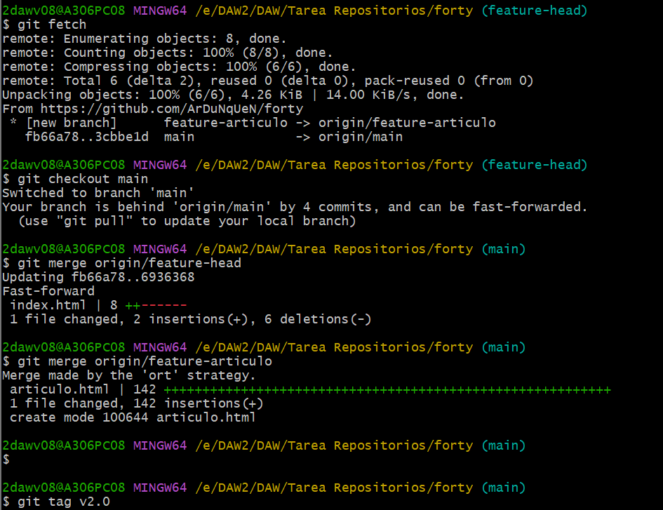

   

5. En tu copia local, crea una rama nueva . En la rama nueva, cambia los enlaces de la página index.html para que apunten correctamente a la nueva página articulo.html . Confirma los cambios. 

   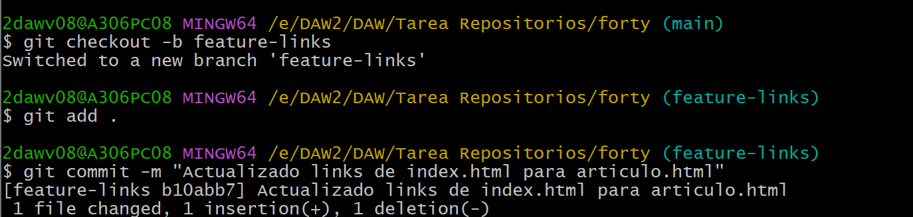

6. Muestra los logs de forma que se vean las ramas en tu copia local. 

   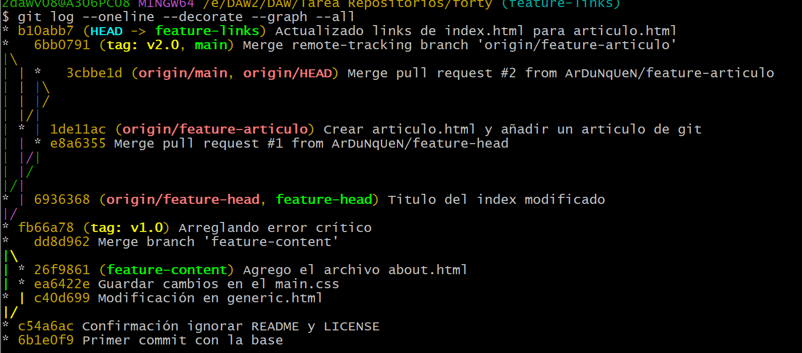

7. Te gusta el resultado de los cambios. Incorpora los cambios de la rama nueva a la principal.

   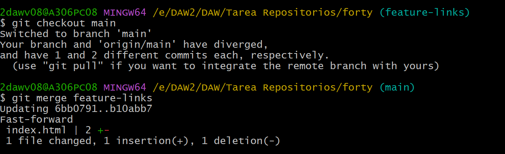

8. Sube los cambios al remoto borrando la rama nueva , si es necesario. Comprueba primero con un comando en local, las ramas que hay en el repositorio remoto.

   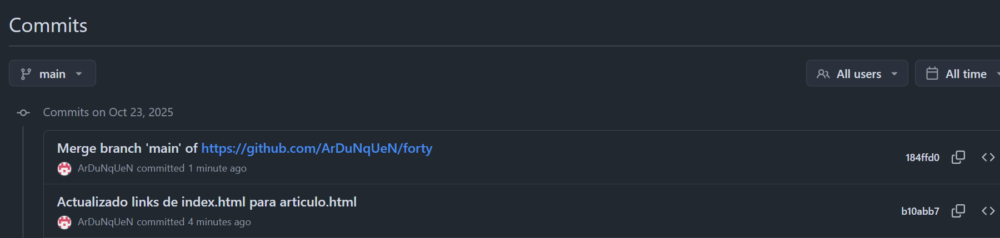

9. Muestra en local los cambios en el archivo index.html entre la versión actual y la anterior. 

   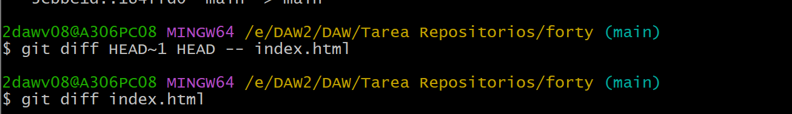

10. En el repositorio en GitHub, navega hasta el archivo index.html y selecciona la opción "History".

    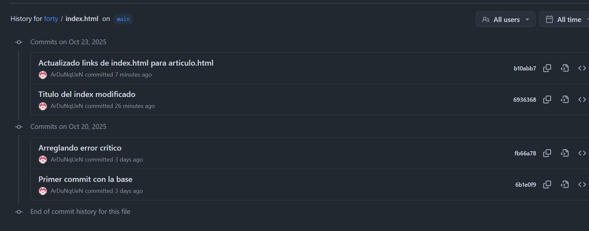
